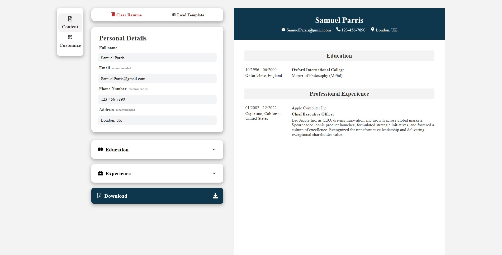
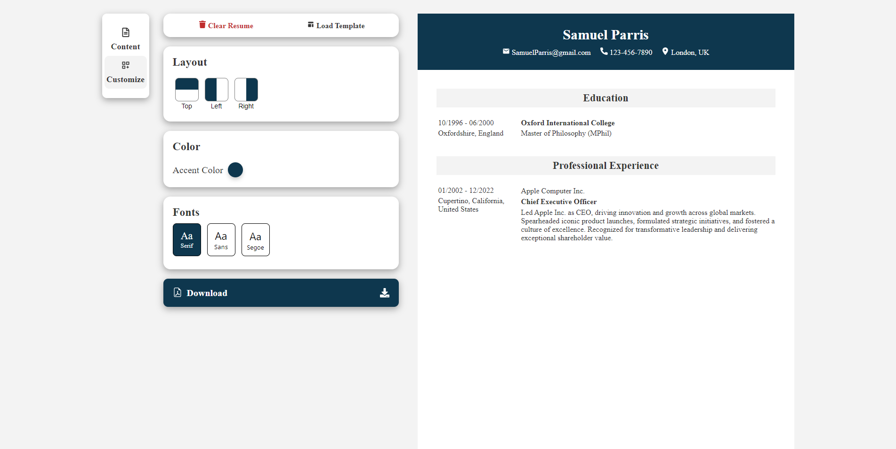

<h1 align="center">Resume Architect</h1>
</span>
<p align="center">
  <a href="https://resume-architect-gamma.vercel.app" style="display:inline-block;">Live App</a>
</p>

<div align="center">
  
  
</div>

## Overview

Resume Architect is a web application built using React, aimed at simplifying the process of creating and customizing CVs/resumes. With a user-friendly interface and intuitive design, Resume Architect enables users to generate professional resumes effortlessly.

This project utilizes several libraries to enhance functionality and user experience:

- **[React Icons](https://www.npmjs.com/package/react-icons)**: Provides a vast collection of icons for various purposes, enhancing the visual appeal of the application.
- **[Chakra UI Accordion](https://www.npmjs.com/package/@chakra-ui/accordion?activeTab=readme)**: Offers a flexible and accessible accordion component to organize and present resume sections neatly.
- **[React-to-PDF](https://www.npmjs.com/package/react-to-pdf)**: Facilitates the conversion of React components into PDF format, allowing users to download and share their resumes seamlessly.

## Features

- **Intuitive Interface**: The application boasts a user-friendly interface, making resume creation and customization hassle-free.
- **Customization Options**: Users can personalize their resumes by choosing from various templates, fonts, colors, and layouts.
- **Real-Time Preview**: Provides a live preview of the resume as users make changes, ensuring instant feedback and adjustments.
- **Downloadable PDFs**: Allows users to download their resumes in PDF format, ready for printing or digital sharing.

## Technologies Used

The following technologies and libraries were used in the development of Resume Architect:

- **React**: A JavaScript library for building user interfaces.
- **Vite**: A fast build tool that leverages modern JavaScript features and ES modules for development.
- **Chakra UI**: A simple, modular and accessible component library that provides building blocks for React applications.
- **React Icons**: A library that provides a vast collection of icons for React applications.
- **React-to-PDF**: A library that facilitates the conversion of React components into PDF format.
- **Vercel**: A cloud platform for static sites and serverless functions, used for hosting the application.

# Getting Started

To get a local copy up and running, follow these steps:

1. Clone the repository:

   ```bash
   git clone https://github.com/IulianGabriel/Resume-Architect.git
   ```

2. Navigate to the project directory:

   ```bash
   cd Resume-Architect
   ```

3. Install dependencies:

   ```bash
   npm install
   ```

4. Start the development server:
   ```bash
   npm run dev
   ```

## Acknowledgements

Special thanks to my friend "eIonut" for their valuable feedback and assistance with code review during the development of this project.

# Deployment

The application is hosted on Vercel, ensuring high availability and seamless deployment. Additionally, continuous integration and deployment pipelines can be set up using Vercel's GitHub integration.

# License

This project is licensed under the MIT License.
